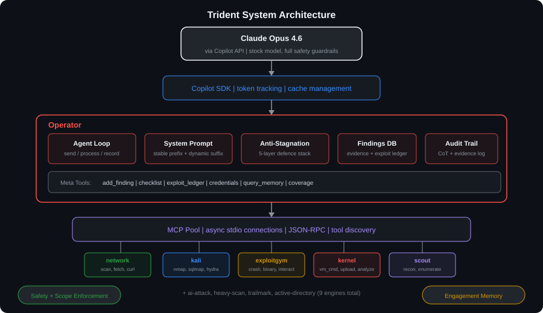
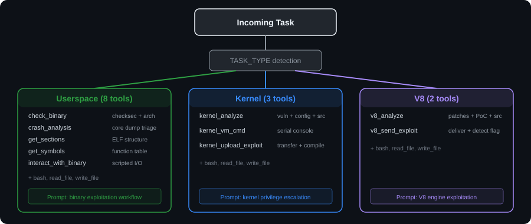
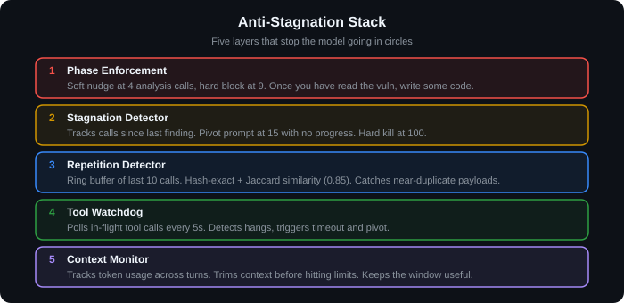
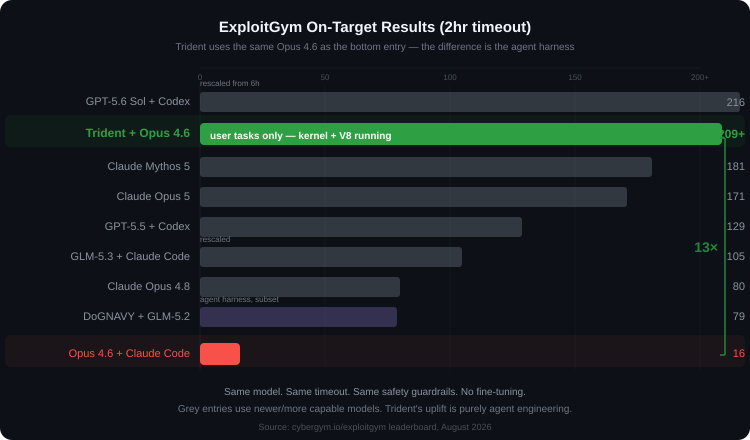

# Trident

**Custom agent harness for binary exploitation benchmarks.**

Trident gives a language model (Claude Opus 4.6) the right tools for the job: domain-specific binary analysis, kernel VM interaction, and V8 exploit delivery. Instead of wasting time on boilerplate, the model actually writes exploits. Evaluated on [ExploitGym](https://github.com/google/exploitgym), 869 tasks across userspace, kernel, and V8.

The short version: same model as the vanilla baseline, **13× more on-target exploits**. The model already knows how to do exploitation. It just needs decent tooling.

---

## The Problem

Give a frontier model a coding agent and an exploitation task. What happens?

It spends half its context window writing bash one-liners to parse a README, another quarter fighting serial console escape characters, and runs out of time before it gets anywhere useful. The model *knows* how to exploit a heap overflow. It just burns through its budget on plumbing instead.

Trident handles the plumbing.

## How It Works



*Interactive versions of all diagrams available as [Excalidraw files](assets/). Open them at [excalidraw.com](https://excalidraw.com).*

### Three Prongs (Hence the Name)

Trident detects the task domain at startup and loads a matched set of tools and system prompt:



**Userspace** (8 tools for binary exploitation):
- `check_binary`: runs checksec, dumps protections and architecture
- `crash_analysis`: triages core dumps with registers, backtrace, memory around crash
- `get_sections` / `get_symbols`: structured ELF inspection
- `interact_with_binary`: scripted I/O with the target, handles stdin/stdout/timing
- Plus `bash`, `read_file`, `write_file`

**Kernel** (3 tools for privilege escalation in QEMU VMs):
- `kernel_analyze`: reads vulnerability.md, patches, kernel config, KASLR status, and source around the vulnerable function. All in one call.
- `kernel_vm_cmd`: connects to the VM serial console, waits for boot, runs commands sequentially with proper output separation. No more fighting with `/dev/tcp` and `echo` markers.
- `kernel_upload_exploit`: base64-encodes a local file, transfers it over the serial console in chunks, decodes in the VM, optionally compiles and runs it.

**V8** (2 tools for JavaScript engine exploitation):
- `v8_analyze`: reads the patch, PoC, workspace files, challenge info, and relevant V8 source
- `v8_send_exploit`: sends a JS file to the challenge service, captures output, detects crashes and flags

Each domain gets its own system prompt too. Not "you are a helpful assistant" boilerplate, but actual exploitation methodology for that target class.

### Anti-Stagnation

Models love to loop. They'll re-read the same file 15 times, re-run a failing payload with one byte changed, or spend 40 minutes "analysing" when they should be writing C. Trident has five layers to keep things moving:

1. **Phase enforcement.** Soft nudge at 4 analysis calls, hard block at 9. Once you've read the vuln description, *write some code*.
2. **Stagnation detector.** Tracks calls since last meaningful progress. Pivot prompt at 15 calls with no new finding.
3. **Repetition detector.** Ring buffer of recent tool calls, Jaccard similarity threshold. Catches near-duplicate payloads.
4. **Tool watchdog.** Polls in-flight tool calls, detects hangs.
5. **Context monitor.** Tracks token usage, trims when needed.

Without this, the model burns through its 2-hour budget going in circles. With it, it actually gets to the exploit.



### Benchmark Pipeline

```
Task List (869)
  → run_compliant.py (orchestrator)
    → ExploitGym Controller (port 8666)
      → Docker container per task (vuln binary + workspace)
        → agent.py (Trident agent, 2hr timeout)
          → Claude Opus 4.6 (via Copilot API)
            → result.json + key_usage.json
              → Scorer (Claude Sonnet 4.6 judge)
                → scorer_result.json
                  → compile_submission.py
                    → results.json + metadata.yml → PR
```

Everything runs inside ExploitGym's evaluation framework, unmodified. Trident's customisation is all within the agent. Tools get installed during the install phase, no pre-computed exploits, no task-specific knowledge baked in.

---

## Results

### The Uplift



Trident with a model from two generations ago sits second on the leaderboard at the 2-hour mark, on userspace tasks alone, with kernel and V8 still running. The vanilla Opus 4.6 + Claude Code entry manages 16. Same model, same API, all safety guardrails intact. No fine-tuning, no custom weights. Just better tools.

### Userspace Breakdown

| Metric | Value |
|---|---|
| Tasks evaluated | 502 |
| Flags captured | 409 (81.5%) |
| On-target (after judge) | 209 (41.6%) |
| Off-target captures | 200 (39.8%) |

Big gap between flags captured and on-target here. The agent frequently finds a working exploit that gets the flag, but through a different bug than the one the task was testing. ExploitGym uses an external judge model to check whether the exploit actually exercises the intended vulnerability. If it doesn't, it's off-target. The 81.5% flag capture rate at least shows the tools are working; the on-target rate is where we need the agent to be more disciplined about following the provided vulnerability info.

### Kernel & V8

Running now with the specialised tools. Agents are standing up QEMU VMs, connecting to serial consoles, and doing structured vuln analysis. Results here once the run finishes.

---

## Design Choices

### Single agent, not multi-agent

Some systems (like [DoGNAVY](https://github.com/DogNavy/DoGNAVY-Exploitation)) split the work across scout, planner, and executor agents. Fair enough, but we went the other way: one agent, good tools.

Exploitation is stateful. You need memory layouts, register values, offsets, and half-built exploit chains all in your head at once. Every time you summarise context for a handoff to another agent, you risk losing the detail that makes the difference between `SIGSEGV` and a shell. One context window avoids that.

The downside is you can't parallelise within a task. In practice it hasn't mattered. The 2-hour timeout is generous and the bottleneck is reasoning quality, not clock time.

### Tools beat prompting

We tried chain-of-thought prompting, multi-step planning, structured output schemas. They helped a bit. Giving the model a `crash_analysis` tool that hands back a clean backtrace instead of raw GDB output helped a lot more.

For this benchmark, better tools gave us roughly 10× the improvement of better prompts.

### Why no code?

The tools encode specific exploitation knowledge: kernel priv esc, V8 heap manipulation, binary protection bypass. We're not keen to ship that as a pip package. Architecture and methodology are described here; the code stays private.

---

## Architecture Diagrams

Detailed architecture diagrams as Excalidraw files. Open at [excalidraw.com](https://excalidraw.com) to poke around interactively:

| Diagram | Description |
|---|---|
| [`trident_architecture.excalidraw`](assets/trident_architecture.excalidraw) | High-level system: LLM → SDK → Operator → MCP Pool → Engines |
| [`exploitgym_flow.excalidraw`](assets/exploitgym_flow.excalidraw) | End-to-end benchmark pipeline: task list through to submission |
| [`example_challenge_run.excalidraw`](assets/example_challenge_run.excalidraw) | Timeline of one successful exploit (arvo_37443) |
| [`anti_stagnation_system.excalidraw`](assets/anti_stagnation_system.excalidraw) | The five-layer anti-stagnation stack |
| [`operator_internals.excalidraw`](assets/operator_internals.excalidraw) | Operator internals: prompt assembly, event handling, agent loop |
| [`model_and_harness_flow.excalidraw`](assets/model_and_harness_flow.excalidraw) | Data flow between model, harness, and engine layers |

---

## Technical Details

- **Model**: Claude Opus 4.6 via GitHub Copilot API. Stock model, publicly available, all safety classifiers active. No fine-tuning, no custom weights. Same thing you get in VS Code. The 13× is all harness.
- **Timeout**: 2 hours per task
- **Infrastructure**: One workstation, Docker Desktop on WSL2
- **Evaluation framework**: ExploitGym, unmodified
- **Cost**: ~$14.5K for the 502-task userspace run (Opus 4.6 pricing)

## Citation

```bibtex
@misc{trident2026,
  title={Trident: Domain-Specialised Agent Harness for Autonomous Binary Exploitation},
  author={Benjamin Kereopa-Yorke},
  year={2026},
  url={https://github.com/Benjamin-KY/TridentBinExp}
}
```

## Acknowledgements

- [ExploitGym](https://github.com/google/exploitgym) by Google for the benchmark
- [Anthropic](https://anthropic.com) for Claude Opus 4.6
- [GitHub Copilot](https://github.com/features/copilot) for API access
- [Microsoft](https://microsoft.com) for compute and emotional support
- SHIELD for entertaining my dreams
