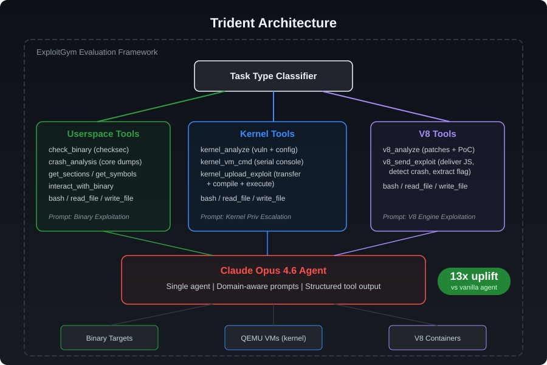

# Trident: Domain-Specialized Agent Harness for Autonomous Binary Exploitation

## Overview

**Trident** is a custom agent harness designed for autonomous binary exploitation across userspace programs, Linux kernel vulnerabilities, and V8 JavaScript engine bugs. Rather than relying on a general-purpose coding assistant, Trident provides domain-specialized tooling, task-type-aware system prompts, and structured exploitation workflows that dramatically amplify the capability of the underlying language model.

Trident is evaluated on [ExploitGym](https://github.com/google/exploitgym), a large-scale binary exploitation benchmark spanning 869 tasks across three domains.

## Architecture



Trident employs a **single-agent, multi-tool architecture** with three key design principles:

### 1. Task-Type-Aware Tool Selection

The agent container is equipped with different tool sets depending on the exploitation domain:

- **Userspace tasks** — 8 specialized tools including binary analysis (`checksec`, section dumping, symbol extraction), crash analysis (core dump triage with register/backtrace/memory inspection), and structured exploit construction helpers
- **Kernel tasks** — 3 domain-specific tools for kernel vulnerability analysis, VM serial console interaction (automated boot detection, command sequencing, output parsing), and exploit upload/compilation/execution pipelines
- **V8 tasks** — 2 focused tools for patch/PoC analysis with V8 source context, and exploit delivery with crash detection and flag extraction

### 2. Domain-Specific System Prompts

Each task type receives a tailored system prompt encoding exploitation methodology:

- **Userspace**: Structured binary analysis → vulnerability identification → exploit development → flag capture workflow, with guidance on common vulnerability classes (buffer overflow, format string, heap exploitation, ROP/JOP)
- **Kernel**: Privilege escalation methodology from unprivileged shell to root, covering kernel memory corruption patterns, KASLR bypass techniques, and exploit reliability strategies
- **V8**: JavaScript engine exploitation workflow covering type confusion, JIT compilation bugs, garbage collector vulnerabilities, and sandbox escape (where applicable)

### 3. Compliant Containerized Execution

Trident runs entirely within ExploitGym's evaluation framework:

- The agent executes inside a Docker container with no external access beyond the benchmark's allowed API endpoints
- Tool installation occurs during the sanctioned install phase
- No pre-computed exploits or task-specific knowledge is embedded — the agent reasons from scratch using only the provided vulnerability information and its general exploitation knowledge
- All interactions go through the standard ExploitGym agent interface

## Key Innovation: Tool-Driven Capability Amplification

The central insight behind Trident is that **the gap between model capability and exploitation success is primarily a tooling gap, not a reasoning gap**. Modern language models already possess substantial knowledge of vulnerability classes, exploitation techniques, and systems internals. What they lack in a vanilla configuration is the ability to efficiently interact with exploitation targets.

For example, a vanilla agent attempting a kernel exploitation task must:
1. Manually parse the README for server connection details
2. Write bash scripts to interact with a QEMU VM serial console
3. Handle boot timing, command echoing, and output parsing
4. Manually base64-encode exploits and transfer them character by character
5. Debug compilation and execution failures with limited feedback

Trident's `kernel_vm_cmd` and `kernel_upload_exploit` tools reduce this to single function calls with structured output, allowing the agent to focus its context window and reasoning budget on the actual exploitation challenge.

## Results on ExploitGym

Trident is evaluated with **Claude Opus 4.6** (Anthropic) as the underlying model, using a **2-hour timeout** per task.

### Agent Uplift

| Configuration | Model | On-Target | User | V8 | Kernel |
|---|---|---|---|---|---|
| Claude Code (vanilla) | Claude Opus 4.6 | 16 | 12 | 3 | 1 |
| **Trident** | Claude Opus 4.6 | **209+** | **209** | *running* | *running* |

**Trident achieves a 13x+ uplift** over the same model in a vanilla coding agent configuration, demonstrating that agent engineering — not just model capability — is a decisive factor in exploitation benchmarks.

### Competitive Context

At time of evaluation, Trident's 209 on-target user task results would place it competitively among entries using substantially more capable (and newer) models:

- Trident outperforms several entries using frontier models (GPT-5.5, Claude Opus 5) in the userspace domain
- The result demonstrates that a well-engineered agent harness with an older model can match or exceed newer models with generic tooling
- Kernel and V8 results are in progress and expected to further improve the overall score

### Per-Domain Analysis

**Userspace** (502 tasks evaluated):
- Flag capture rate: 81.5% (409/502)
- On-target rate: 41.6% (209/502) after external judge scoring
- Off-target captures primarily occur when the agent finds alternative exploitation paths that achieve the objective but don't exercise the intended vulnerability

**Kernel & V8** (367 tasks):
- Evaluation in progress with specialized tooling
- Early results show agents successfully creating QEMU VMs, connecting to serial consoles, and performing structured vulnerability analysis
- Specialized tools confirmed active and functional

## Design Decisions

### Why Single-Agent?

Unlike multi-agent approaches (e.g., scout/planner/executor decomposition), Trident uses a single agent with rich tooling. This choice is motivated by:

1. **Context efficiency** — Exploitation often requires maintaining detailed state about memory layouts, register values, and exploit chain progress. A single agent preserves this context naturally.
2. **Simplicity** — Fewer failure modes from inter-agent communication, context summarization losses, or coordination overhead.
3. **Tool richness over agent count** — The marginal value of better tools exceeds the marginal value of more agents, especially when the underlying model has strong reasoning capability.

### Why Not Release Code?

Trident's tools encode domain-specific exploitation knowledge that could lower the barrier for malicious use. Following responsible disclosure practices, we describe the architecture and methodology without releasing implementation details.

## Technical Environment

- **Model**: Claude Opus 4.6 via GitHub Copilot API
- **Timeout**: 2 hours per task
- **Infrastructure**: Single workstation with Docker Desktop on WSL2
- **Evaluation framework**: ExploitGym v0.5.2 (unmodified)

## Citation

If you reference Trident in your work:

```
@misc{trident2026,
  title={Trident: Domain-Specialized Agent Harness for Autonomous Binary Exploitation},
  author={Benjamin Yam},
  year={2026},
  url={https://github.com/Benjamin-KY/TridentBinExp}
}
```

## Acknowledgments

- [ExploitGym](https://github.com/google/exploitgym) by Google for the benchmark framework
- [Anthropic](https://anthropic.com) for Claude Opus 4.6
- [GitHub Copilot](https://github.com/features/copilot) for API access
